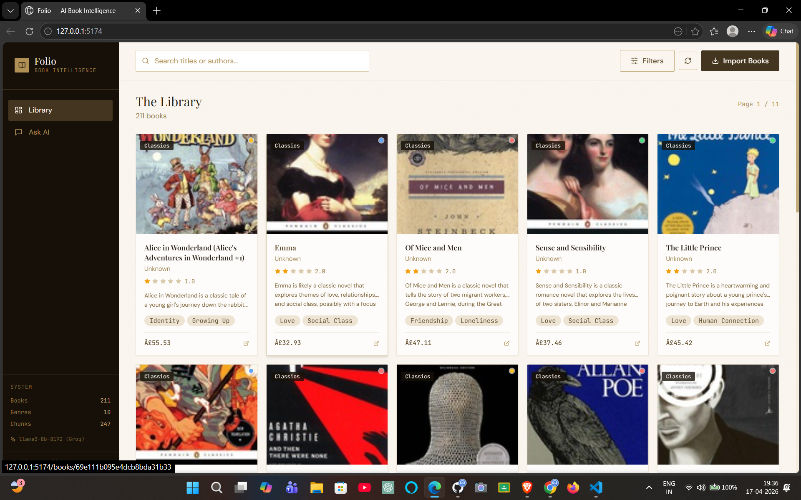
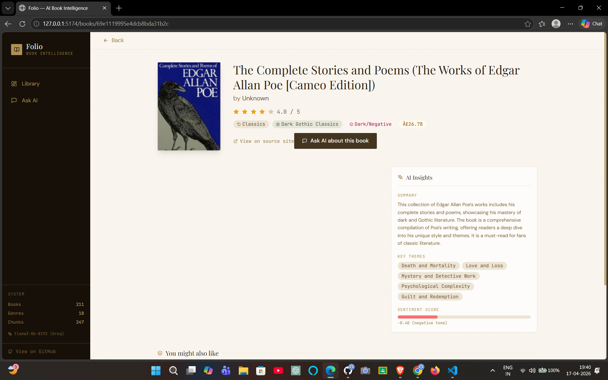
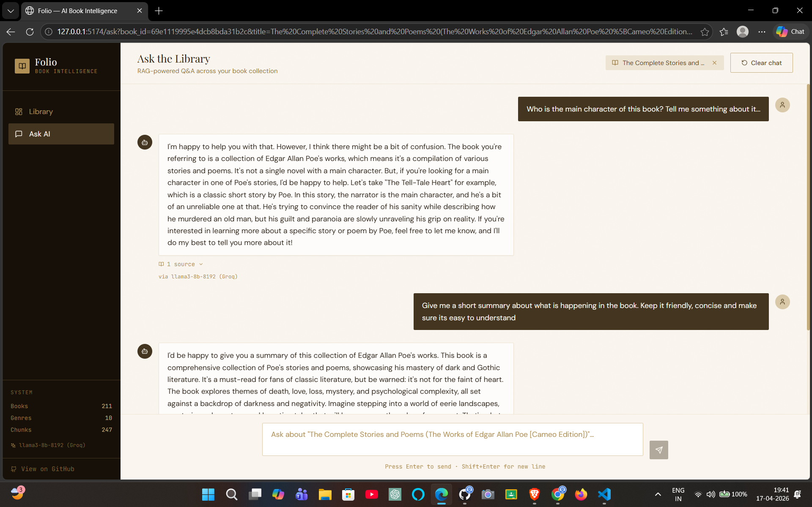

# 🚀 Book Intelligence Platform

[](https://github.com/SHUBHAM-PANDEY/book-intelligence)
[](LICENSE)
[](https://fastapi.tiangolo.com/)
[](https://reactjs.org/)
[](https://mongodb.com/)
[](https://docs.trychroma.com/)
[](https://tailwindcss.com/)

**AI-Powered Book Discovery & Intelligence Platform**

Scrape books from the web, store embeddings, ask intelligent questions with RAG (Retrieval-Augmented Generation), get recommendations, and explore your library with LLM insights!

## 📋 Table of Contents
- [✨ Features](#-features)
- [📸 Screenshots](#-screenshots)
- [🚀 Quick Start](#-quick-start)
- [🛠️ Detailed Setup](#️-detailed-setup)
- [📚 API Documentation](#-api-documentation)
- [💬 Sample Questions](#-sample-questions--answers)
- [🏗️ Project Structure](#️-project-structure)
- [🔍 Troubleshooting](#-troubleshooting)
- [🚀 Next Steps](#-next-steps--contributing)
- [📄 License](#-license)

## 🛠️ Tech Stack
- **Backend**: FastAPI, MongoDB, ChromaDB (vector DB), Selenium/BeautifulSoup (scraping)
- **Frontend**: React 18, Vite, Tailwind CSS
- **AI/ML**: Gemini 1.5 / Groq, RAG pipeline
- **Other**: Pydantic, Motor (async Mongo), CORS

## ✨ Features

- **🕷️ Web Scraping**: Automatically scrape book details, ratings, and content from websites
- **🔍 RAG Q&A**: Ask questions about books and get answers with source citations from ChromaDB
- **🎯 Smart Recommendations**: Vector similarity + genre-based book suggestions
- **📚 Rich Book Database**: MongoDB-powered with full-text search and filtering
- **🤖 LLM Insights**: AI-generated summaries, themes, and analysis (Gemini or Groq)
- **⚡ Modern Stack**: FastAPI + React + Tailwind + Vite
- **📊 Stats & Analytics**: Health checks, collection stats, genre browsing

## 📸 Screenshots

<div align="center">

### 🏠 Dashboard - Book Library Overview


### 📖 Book Details - Insights & Recommendations


### 💬 Q&A Interface - Ask Your Library


</div>

*Pro tip: Screenshots shown in desktop view. Responsive on mobile!*

## 🚀 Quick Start

### Prerequisites
- MongoDB (local or cloud)
- Node.js 18+
- Python 3.10+

### 1. Clone & Setup Backend
```bash
cd backend
pip install -r requirements.txt
cp .env.example .env  # Create .env
```

**Edit `.env`:**
```
MONGODB_URL=mongodb://localhost:27017
DATABASE_NAME=book_intelligence
GEMINI_API_KEY=your_gemini_key  # OR
GROQ_API_KEY=your_groq_key
LLM_PROVIDER=gemini  # or groq
CHROMA_DB_PATH=./chroma_db
```

```bash
uvicorn main:app --reload --port 8000
```

### 2. Setup Frontend
```bash
cd frontend
npm install
echo "VITE_API_URL=http://localhost:8000" > .env
npm run dev  # http://localhost:5173
```

### 3. First Run
1. Open http://localhost:5173
2. Click **Scrape Books** → Select genre → Start!
3. Once books are scraped, try **Ask the Library** Q&A

**Health Check:** `GET http://localhost:8000/health`

## 🛠️ Detailed Setup

### Backend Services
| Service | Purpose | Status Check |
|---------|---------|--------------|
| MongoDB | Book metadata | `/health` → `mongodb: ok` |
| ChromaDB | Vector embeddings | `/health` → `chromadb: ok` |
| LLM | Q&A & Insights | `/health` → `llm_model: gemini-1.5-flash` |

### Environment Variables
```
MONGODB_URL=mongodb://localhost:27017
DATABASE_NAME=book_intelligence
GEMINI_API_KEY=...  # https://aistudio.google.com/app/apikey
GROQ_API_KEY=...    # https://console.groq.com/keys
LLM_PROVIDER=gemini # gemini or groq
CHROMA_DB_PATH=./chroma_db
ALLOWED_ORIGINS=http://localhost:5173
```

## 📚 API Documentation

**Base URL:** `http://localhost:8000`

Auto-generated docs: http://localhost:8000/docs

### Books Endpoints
| Method | Endpoint | Description |
|--------|----------|-------------|
| `GET` | `/api/books/` | List books (paginated, search, genre filter) |
| `GET` | `/api/books/:id` | Get book details |
| `GET` | `/api/books/:id/recommendations` | Get similar books |
| `GET` | `/api/books/genres` | List genres |
| `GET` | `/api/books/stats` | Database stats |
| `POST` | `/api/books/scrape` | Scrape new books `{max_pages: 5, genre_filter: 'mystery'}` |
| `POST` | `/api/books/ask` | RAG Q&A `{question: '...', book_id: '...'}?` |

### Sample API Calls

**Scrape Books:**
```bash
curl -X POST http://localhost:8000/api/books/scrape \
  -H "Content-Type: application/json" \
  -d '{"max_pages": 3, "genre_filter": "sci-fi"}'
```

**Ask Question:**
```bash
curl -X POST http://localhost:8000/api/books/ask \
  -H "Content-Type: application/json" \
  -d '{"question": "Which books have adventure themes?"}'
```

**Full Response Example:**
```json
{
  "question": "Best mystery books?",
  "answer": "Based on your library, top mystery books include...",
  "sources": [
    {
      "book_id": "123",
      "title": "The Silent Patient",
      "author": "Alex Michaelides",
      "relevance_score": 0.92,
      "excerpt": "A psychological thriller..."
    }
  ],
  "model_used": "gemini-1.5-flash"
}
```

## 💬 Sample Questions & Answers

Try these in the Q&A interface:

| Question | Expected Answer |
|----------|-----------------|
| `Which books have the most positive reviews?` | Lists highest-rated books with citations |
| `Recommend a mystery book with dark themes` | Vector-similar + genre fallback recs |
| `What are books about adventure and exploration?` | RAG search across all book content |
| `Summarize themes in sci-fi books` | LLM insights with source chunks |
| `Compare two books by same author` | Cross-book analysis |

**Example Response:**
```
Q: Which books are suitable for beginners?

A: For beginners, I'd recommend:
• "The Hobbit" by J.R.R. Tolkien (accessible fantasy adventure)
• "Charlotte's Web" by E.B. White (heartwarming children's classic)

Sources:
1. The Hobbit (95% match) - "perfect entry to fantasy for young readers"
2. Charlotte's Web (88% match) - "simple language, teaches empathy"
```

## 🏗️ Project Structure

```
book-intelligence/
├── backend/           # FastAPI + MongoDB + ChromaDB
│   ├── main.py
│   ├── app/routers/books.py
│   ├── app/services/llm_service.py
│   ├── app/services/scraper.py
│   └── chroma_db/     # Vector store
├── frontend/          # React + Tailwind + Vite
│   ├── src/pages/QnA.jsx
│   ├── src/utils/api.js
│   └── src/components/BookCard.jsx
├── README.md
└── .env.example
```

## 🔍 Troubleshooting

| Issue | Solution |
|-------|----------|
| `MongoDB error` | Start MongoDB: `mongod` or use Docker |
| `No embeddings` | Wait for scrape background tasks |
| `CORS error` | Add origin to `ALLOWED_ORIGINS` |
| `LLM quota exceeded` | Switch `LLM_PROVIDER` or get new API key |
| `Frontend can't find API` | Set `VITE_API_URL=http://localhost:8000` |

## 🚀 Next Steps / Contributing

1. Add more scrapers (Goodreads, Amazon)
2. Multi-LLM support (OpenAI, Anthropic)
3. User auth & saved conversations
4. Advanced analytics (reading trends)

**Contribute:** Fork → Branch → PR!

## 📄 License
MIT License - see [LICENSE](LICENSE)

---

⭐ **Star on GitHub if you found this useful!** ⭐

